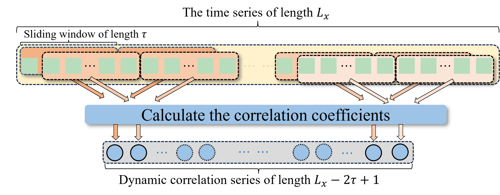
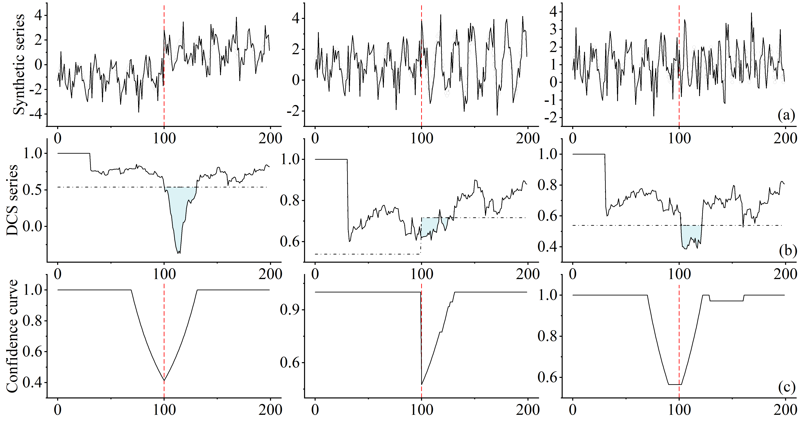
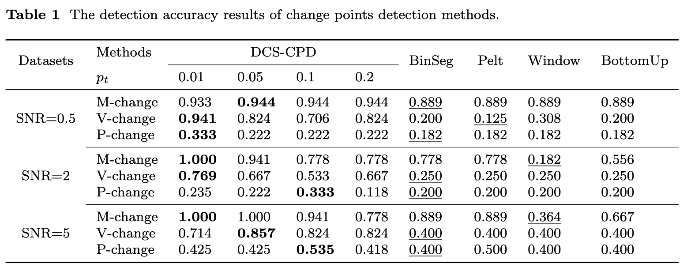
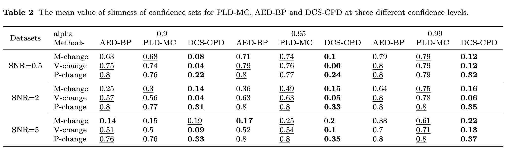

# Change Point Detection in Time Series via Discrete Cosine Similarity with Confidence Level Estimation

## Introduction

This paper introduces DCS-CPD, a novel change points detection method for time series based on discrete cosine similarity (DCS). The method constructs a similarity series that represents the statistical properties of the original data, allowing for the detection of structural changes. DCS-CPD effectively identifies change points by analyzing the DCS series, which follows a specific distribution when no change points exist, while substantial decreases in similarity indicate potential change points. Furthermore, the method derives a relationship between the confidence level of detected change points and the decision thresholds, enabling both accurate localization and confidence  assessment of change points. Compared to traditional methods that rely on resampling or strong distributional assumptions, DCS-CPD is distribution-agnostic, providing higher computational efficiency and broader applicability. Experiments on synthetic and real-world datasets demonstrate the accuracy and robustness of DCS-CPD, along with its ability to provide reliable confidence estimates for change points across diverse time series data. 

## Synthetic Datasets

The synthetic datasets are crafted by **CraftedData.py**. 

Run 

```cmd
python CraftedData.py --length 1000 --peroid 16
```

to creat the synthetic datasets with the length of 1000 and the peroid of 16. 

## Discrete cosine similarity (DCS)



## DCS-CPD

The function to detect the change points is defined in **DCS_CPD.py**. 

## Illustration of DCS-CPD for synthetic series.



As shown in (a), changes in mean, variance, and period were introduced at position $n=100$, respectively. With the threshold $p_t = 0.1$, (b) displays the corresponding DCS series along with the DCS threshold $y_t$. (c) presents the confidence curve derived from the $y_t$. 

## Experiment results





