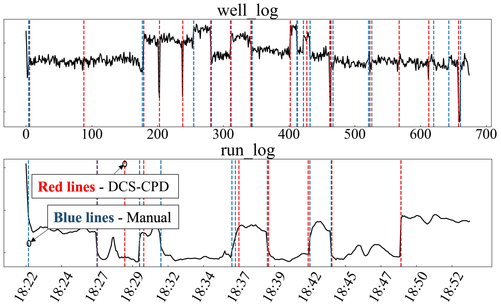

# Change Point Detection in Time Series via Discrete Cosine Similarity with Confidence Level Estimation

## Introduction

This paper introduces DCS-CPD, a novel method for change point detection in time series using cosine similarity. The method constructs a cosine similarity series that represents the statistical properties of the original series, allowing for the detection of change points. When no change points are present, the series follows a specific distribution, while deviations indicate potential change points. 
DCS-CPD derives the relationship between the change point probability and cosine similarity, enabling precise localization and probability estimation. Compared to traditional methods, DCS-CPD offers superior computational efficiency and broader applicability. Experiments on synthetic and real-world datasets validate its accuracy, robustness, and ability to provide reliable probability estimates for detected change points. 

## Synthetic Datasets

The synthetic datasets are crafted by **CraftedData.py**. 

Run 

```cmd
python CraftedData.py --length 1000 --peroid 16
```

to creat the synthetic datasets with the length of 1000 and the peroid of 16. 

## Discrete cosine similarity (DCS)


Let the CS series be denoted by $\boldsymbol{Y} = \\{ y_i \\}_ {1\leq i \leq L-2\tau+1 }$, where $y_i$ denotes the $i$-th CS value computed from the original series. With this scheme, we expect a smaller $y_i$ if change points exist in [ $\boldsymbol{\tilde{X_i}}$, $\boldsymbol{\tilde{X}_{i+\tau}}$ ]. Similarly,  $x_i$ is involved in calculating the elements in $\boldsymbol{\tilde{Y_i}}$, which means when we observe that a certain number of smaller $y$ in $\boldsymbol{\tilde{Y_i}}$, chances are that $x_i$ is a change point. $\boldsymbol{\tilde{S}_i}$ denotes the set of elements required to compute each CS value in $\boldsymbol{\tilde{Y}_i}$, which includes all elements ${x_j}$ such that $i - 2\tau + 1 \leq j \leq i + 2\tau - 1$. 

## DCS-CPD

The function to detect the change points is defined in **DCS_CPD.py**. 

## Illustration of DCS-CPD for real-world datasets. 



## Experiment results


## Time efficiency

DCS-CPD has a complexity of $\mathcal{O}(\tau L)$. 


